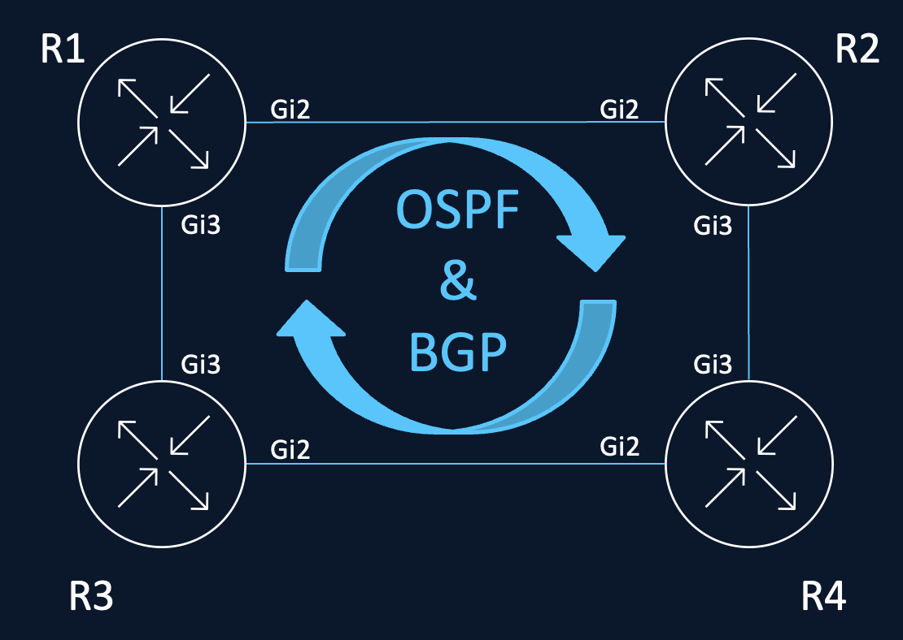
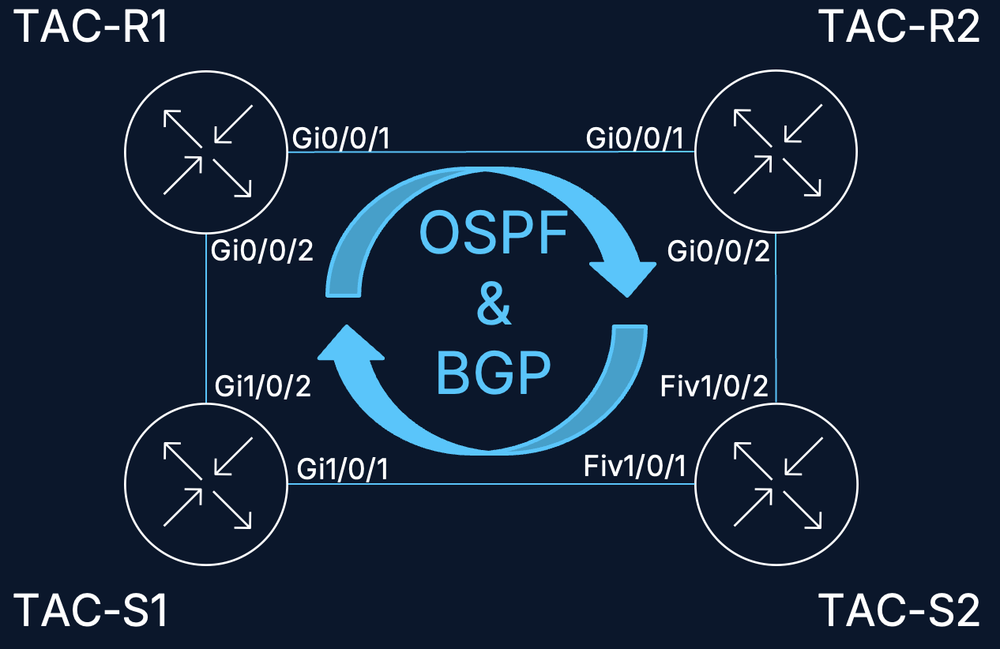

# BRKXAR-2032 - Cisco Live United States Las Vegas 2026

This repository demonstrates automated network testing using [Huginn](https://github.com/ChartinoLabs/Huginn) and [Muninn](https://github.com/ChartinoLabs/Muninn). It validates network state before, during, and after operational changes - catching convergence issues, protocol flaps, and configuration drift automatically.

---

## Testbed Environments

This demo ships with **two testbed definitions** - a virtual lab and a physical lab. You are free to fork this repository and adapt either (or both) to your own environment.

| Environment   | Directory              | Devices                   | Notes                       |
| ------------- | ---------------------- | ------------------------- | --------------------------- |
| Virtual (CML) | `virtual-cml-testbed/` | 4x Catalyst 8000v routers | Runs on Cisco Modeling Labs |
| Physical      | `physical-testbed/`    | 4x IOS-XE routers         | Real IOS-XE hardware        |

Select which environment to use via the `ENV` variable in your `.env` file:

```bash
# .env
ENV=virtual-cml-testbed    # or: physical-testbed
```

> **When forking this repo**, you will need to update `testbed.yaml` in your chosen environment directory with your own device IPs, hostnames, ports, and credentials. See [Adapting to Your Environment](#adapting-to-your-environment) below.

---

## Topology

### Virtual CML Testbed

Four IOS-XE routers in a square mesh running OSPF area 0 and iBGP full-mesh (AS 65000):

<p align="center">
  
</p>

### Physical Testbed

Four IOS-XE routers in a square mesh running OSPF area 0 and iBGP full-mesh (AS 65000):

<p align="center">
  
</p>

---

## Quick Start

```bash
# 1. Install dependencies
uv sync

# 2. Configure your environment
cp .env.example .env
# Edit .env to set ENV=virtual-cml-testbed or ENV=physical-testbed

# 3. Learn the baseline state of your network
make baseline

# 4. Run the full test plan
make test
```

---

## Makefile Reference

All targets respect the `ENV` and `SCENARIO` variables (defaults: `virtual-cml-testbed` and `link-shutdown-r1r2`).

### End-to-End Execution

| Target          | Description                                                 |
| --------------- | ----------------------------------------------------------- |
| `make baseline` | Learn the expected state of the entire network (all phases) |
| `make test`     | Execute the full test plan against the network              |

### Phase-by-Phase Execution

Run each phase of a scenario individually for debugging or step-by-step demos:

| Target                  | Phase          | Description                                |
| ----------------------- | -------------- | ------------------------------------------ |
| `make learn-pre-change` | pre-change     | Learn expected state before any changes    |
| `make pre-change`       | pre-change     | Verify network matches pre-change baseline |
| `make shutdown`         | shutdown       | Execute the link shutdown action           |
| `make post-shutdown`    | post-shutdown  | Verify network state after shutdown        |
| `make normalize`        | normalize      | Execute the link restore action            |
| `make post-normalize`   | post-normalize | Verify network recovered to baseline       |

### Reconciliation

When expected state changes (e.g., a link goes down), reconciliation updates the test parameters to reflect the new "known good" state:

| Target                         | Description                                                 |
| ------------------------------ | ----------------------------------------------------------- |
| `make learn-post-shutdown`     | Learn the network state after shutdown (for reconciliation) |
| `make reconcile-post-shutdown` | Reconcile test parameters to match post-shutdown state      |
| `make clean-parameters`        | Delete learned parameters (keeps ACTION and GATE files)     |

### Infrastructure as Code

Manage device configuration via Terraform (IOS XE as Code under Cisco's [Network as Code umbrella](https://netascode.cisco.com)):

| Target          | Description                                                 |
| --------------- | ----------------------------------------------------------- |
| `make tf-init`  | Initialize Terraform in the environment's `xeac/` directory |
| `make tf-plan`  | Preview configuration changes                               |
| `make tf-apply` | Apply configuration to devices                              |

### Code Quality

| Target         | Description                                       |
| -------------- | ------------------------------------------------- |
| `make quality` | Run ruff format, ruff check, and ty type-checking |

---

## Demo Scenario: Link Shutdown and Recovery

The default scenario (`link-shutdown-r1r2`) demonstrates automated validation across an operational change - shutting down the R1-to-R2 link and verifying convergence:

**Phase flow (end-to-end via `make test`):**

1. **Pre-change** - Verify baseline state (version, interfaces, OSPF, BGP)
2. **Shutdown** - Shut R1 GigabitEthernet2 (the R1-R2 link)
3. **Convergence gate** - Wait for OSPF/BGP to reconverge around the failure
4. **Post-shutdown** - Verify protocols reconverged correctly
5. **Normalize** - Restore R1 GigabitEthernet2
6. **Convergence gate** - Wait for protocols to recover
7. **Post-normalize** - Verify full recovery to original baseline

When running **end-to-end** (`make test`), convergence gates execute automatically between phases - Huginn polls protocol state until the topology stabilizes before proceeding.

When running **phase-by-phase** with individual Makefile targets, there are no automatic gates between your commands. You must wait (~30-60s) for the network to converge before running the next verification phase:

1. `make pre-change` - Verify baseline state
2. `make shutdown` - Shut R1 GigabitEthernet2
3. **Wait ~30-60s** for OSPF/BGP to reconverge
4. `make post-shutdown` - Verify post-failure state
5. `make normalize` - Restore R1 GigabitEthernet2
6. **Wait ~30-60s** for protocols to recover
7. `make post-normalize` - Verify full recovery

---

## Adapting to Your Environment

When you fork this repository, update the following to match your lab:

1. **`<env>/testbed.yaml`** - Device hostnames/IPs, SSH/NETCONF ports, credentials
2. **`.env`** - Set `ENV` to your chosen testbed directory
3. **`<env>/xeac/`** - Terraform variables for your device management IPs (if using IaC)
4. **`<env>/parameters/`** - Delete learned parameters (`make clean-parameters`) and re-learn against your devices (`make baseline`)

The test plan structure (`test_plan/scenarios.yaml`, `test_plan/test_cases/`, `test_plan/groups/`) can be reused as-is or modified to test different scenarios.

---

## Built With

| Project                                          | Description                                                                                      |
| ------------------------------------------------ | ------------------------------------------------------------------------------------------------ |
| [Huginn](https://github.com/ChartinoLabs/Huginn) | Network test automation framework - learns expected state, executes test plans, reconciles drift |
| [Muninn](https://github.com/ChartinoLabs/Muninn) | Network state parsers - structured parsing of CLI/API output across IOS-XE, IOS-XR, NX-OS        |
| [IOS XE as Code](https://netascode.cisco.com)    | Terraform-based network configuration management                                                 |
